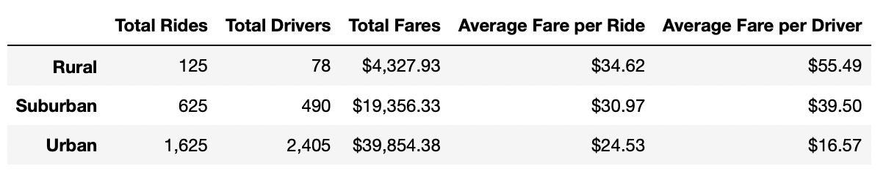

# PyBer_Analysis

## Overview
PyBer is a ride-sharing app company valued at $2.3 billion. The purpose of this project is analyze PyBer's ride-share data for different city types and to create compelling visualization to help management make business decisions. The analysis is based on PyBer's ride-share data for 120 cities from January to early May of 2019.

## Resources
Data Source: 

city_data.csv

ride_data.csv

## Results
The table below summarizes ride-sharing statistics for three city types - rural, suburban, and urban.
  

  
* Urban cities had the highest number of rides, number of drivers and total fares, and the lowest averge fare per ride and average fare per driver 
* Rural cities had the lowest number of rides, number of drivers and total fares, and the highest average fare per ride and average fare per driver
* Suburban city statistics fall in between those of Rural and Urban
* In urban cities, there were far more available drivers than demand for rides (avg fare per driver is $17), suggesting there is an imbalance between supply and demand
* In rural cities, the opposite is true - there were far more rides relative to available drivers (avg fare per driver is $55)

The chart below shows weekly fares by city type from January to April 2019. Suburban fares were roughly half those of Urban fares, while fares in Rural cities were significantly lower than Urban and Suburban.

 

## Summary

Recommendations based on the analysis:
1. In urban cities where there is a robust supply of drivers, PyBer can try to generate more demand for ride-sharing to increase revenue
2. Similarly, PyBer can try to generate more demand for ride-sharing in suburban and rural areas, although demand may be limited due to higher car ownership in these areas
3. To better meet demand for rides in rural cities, PyBer should try to increase the number of available drivers

