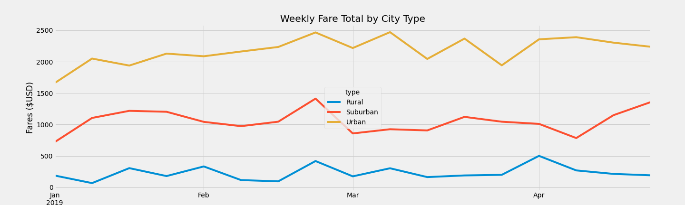

# PyBer_Analysis

## Overview
PyBer is a ride-sharing app company valued at $2.3 billion. The purpose of this project is analyze ride-share data for different city types and to create compelling visualization that helps management make business decisions. The data is based on PyBer's ride-share data for 120 cities from January to early May of 2019.

## Resources
Data Source: 
city_data.csv
ride_data.csv

## Results
Replacing the Thomas High School 9th grade scores had the following impacts:

* District summary - average scores and passing rates all decreased compared to the original analysis

  Before change:
  
  
  
  After change:
  
  
  

* Scores by school spending - the change impacted the $631-$645 per student spending range. It increased the range's average reading score while lowering the math score, math passing rate, reading passing rate, and overall passing rate. It did not impact the metrics for other spending ranges.

* Scores by school size - the change increased the medium-sized school average reading score while lowering math score, math passing rate, reading passing rate, and overall passing rate. It did not impact the metrics for other school sizes.

* Scores by school type - the change increased the Charter school average reading score while lowering math score, math passing rate, reading passing rate, and overall passing rate. It did not impact the metrics for District schools.

## Summary

The changes to the school district analysis can be summarized as follows:

1. District average scores and passing rates all decreased compared to the original analysis
2. Thomas High School's average reading score increased while math score, math passing rate, reading rate and overall passing rate  decreased
3. Thomas High School's ranking remains at 2nd place based on overall passing rate
4. For the following categrories, ehe average reading score increased, while the math score, math passing rate, reading passing rate, and overall passing rate decreased:
    - $631-$645 spending range
    - Medium-sized schools
    - Charter schools

